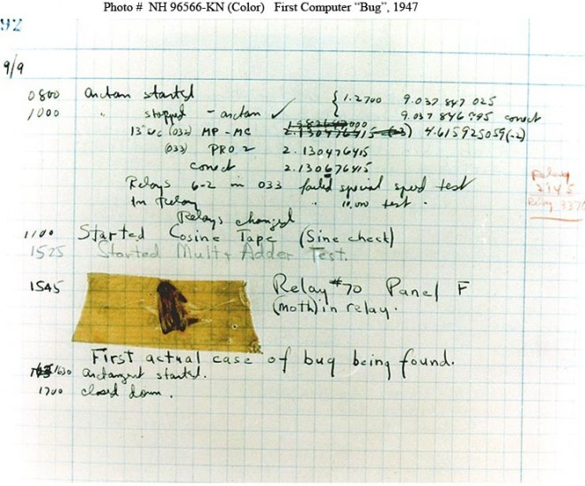

# Intermezzo: Debugging 1

_**This is a Makers Vine.** Vines are designed to gradually build up
sophisticated skills. They contain a mixture of text and video, and may contain
some challenge exercises without proposed solutions. [Read more about how to use
Makers
Vines.](https://github.com/makersacademy/course/blob/main/labels/vines.md)_

Learn to debug simple and complex single-method programs.

## Introduction

Debugging literally means 'removing bugs'. The name comes from a story about the
computing pioneer Grace Hopper, who once tracked down a problem to a literal
bug, taping it to her report for good measure:



You can see from the above page that Hopper was following a methodical process.

Earlier we described test-driving and free-running development as two approaches
to creating software. In this exercise we will see the difference between
**Change Debugging** and **Discovery Debugging**. Change debugging works when
the problem is simple, but fails when the problem is complex.

## Exercise 1

Set a timer for 10 minutes.

Your challenge is to debug the program below before the timer goes off. When you
fix the program or the timer goes off, move on to the next exercise.

```python
def say_hello(name):
    return "hello {name}"


# Intended output:
#
# > say_hello("kay")
# => "hello kay"
```

## Exercise 2

Set a timer for 10 minutes.

Your challenge is to debug the program below before the timer goes off. When you
fix the program or the timer goes off, move on to the next exercise.

```python
def encode(text, key):
    cipher = make_cipher(key)

    ciphertext_chars = []
    for i in text:
        ciphered_char = chr(65 + cipher.index(i))
        ciphertext_chars.append(ciphered_char)

    return "".join(ciphertext_chars)


def decode(encrypted, key):
    cipher = make_cipher(key)

    plaintext_chars = []
    for i in encrypted:
        plain_char = cipher[65 - ord(i)]
        plaintext_chars.append(plain_char)

    return "".join(plaintext_chars)


def make_cipher(key):
    alphabet = [chr(i + 98) for i in range(1, 26)]
    cipher_with_duplicates = list(key) + alphabet

    cipher = []
    for i in range(0, len(cipher_with_duplicates)):
        if cipher_with_duplicates[i] not in cipher_with_duplicates[:i]:
            cipher.append(cipher_with_duplicates[i])

    return cipher

# When you run this file, these next lines will show you the expected
# and actual outputs of the functions above.
print(f"""
 Running: encode("theswiftfoxjumpedoverthelazydog", "secretkey")
Expected: EMBAXNKEKSYOVQTBJSWBDEMBPHZGJSL
  Actual: {encode('theswiftfoxjumpedoverthelazydog', 'secretkey')}
""")

print(f"""
 Running: decode("EMBAXNKEKSYOVQTBJSWBDEMBPHZGJSL", "secretkey")
Expected: theswiftfoxjumpedoverthelazydog
  Actual: {decode('EMBAXNKEKSYOVQTBJSWBDEMBPHZGJSL', 'secretkey')}
""")

```

## Interlude: Methodical Debugging

_[A condensed video explanation of this section is
here.](https://youtu.be/YtRdDfO7aVA?t=0s)_

Exercise 2 probably felt hard. Most bugs are so easy we can solve them without
thinking. But most of the _time_ you spend debugging will be on the hard bugs.

This is why debugging is our third key engineering practice. The better you are
at debugging, the less time you spend not knowing what is going on, and the more
effective you will be — both here and in the industry.

It's time to explain Change Debugging and Discovery Debugging.

* **Change Debugging**  
  You figure there is a problem in the code, and so you stare at the code
  looking for the most suspicious-seeming part of it. You change that part and
  run the code to see if it works. If it doesn't, you keep looking for new
  changes to make.

  The problem with this style is that there are approximately an infinite number
  of changes you can make to any complex code. The chances of you landing on the
  right fix are very small, especially if you are inexperienced.

  In Change Debugging, the program is an obstacle to be overcome.

* **Discovery Debugging**  
  You focus instead on investigating and examining how the code executes, the
  flow of control, which ifs and loops run and how many times, the values of
  variables as they change through the program. You build up your understanding
  of what the program is doing until you're quite sure you understand the
  problem.

  You discover the bug first, and only then do you apply a change to fix it. If
  your change is wrong, you go back to discovery mode.

  In Discovery Debugging, the code is an artefact to be studied.

Both approaches are fine. If you can see the right change immediately and fix
it, that's great! But if you find your changes don't work or the code is
complex, Discovery Debugging is the right tool.

## Getting Visibility

Our most powerful tool for Discovery Debugging is 'getting visibility' — using
`print` to print out values in the program.

[Here is a demonstration of Getting
Visibility](https://www.youtube.com/watch?v=e3XttC2zKWk&t=0s). You may find
the below code useful to refer to.

```python
def factorial(n):
    product = 1
    print(f"at the start product is {product}")
    while n > 0:
        n -= 1
        print(f"we multiply {product} by {n}")
        product *= n
        print(f"we get {product}")
      
    return product

print(f"""
 Running: factorial(5)
Expected: 120
  Actual: {factorial(5)}
""")

```

## Exercise

Return to this example and debug it using Discovery Debugging.

If you can, forget about trying to solve it. Instead, discover as much as you
can about what is going on in the program.


``` python
def encode(text, key):
    cipher = make_cipher(key)

    ciphertext_chars = []
    for i in text:
        ciphered_char = chr(65 + cipher.index(i))
        ciphertext_chars.append(ciphered_char)

    return "".join(ciphertext_chars)


def decode(encrypted, key):
    cipher = make_cipher(key)

    plaintext_chars = []
    for i in encrypted:
        plain_char = cipher[65 - ord(i)]
        plaintext_chars.append(plain_char)

    return "".join(plaintext_chars)


def make_cipher(key):
    alphabet = [chr(i + 98) for i in range(1, 26)]
    cipher_with_duplicates = list(key) + alphabet

    cipher = []
    for i in range(0, len(cipher_with_duplicates)):
        if cipher_with_duplicates[i] not in cipher_with_duplicates[:i]:
            cipher.append(cipher_with_duplicates[i])

    return cipher

# When you run this file, these next lines will show you the expected
# and actual outputs of the functions above.
print(f"""
 Running: encode("theswiftfoxjumpedoverthelazydog", "secretkey")
Expected: EMBAXNKEKSYOVQTBJSWBDEMBPHZGJSL
  Actual: {encode('theswiftfoxjumpedoverthelazydog', 'secretkey')}
""")

print(f"""
 Running: decode("EMBAXNKEKSYOVQTBJSWBDEMBPHZGJSL", "secretkey")
Expected: theswiftfoxjumpedoverthelazydog
  Actual: {decode('EMBAXNKEKSYOVQTBJSWBDEMBPHZGJSL', 'secretkey')}
""")
```

<details>
  <summary>:blue_heart: A few pieces of advice for if you get stuck.</summary>

  ---

  **Frustrated?**  
  If you feel frustrated, it might be because you're trying too hard to get to
  the answer. I know it's difficult, but release that pressure. The effective
  debugger is focused on understanding what is going on, not on trying to make
  it work. It's hard to understand if you're placing yourself under stress.
  
  Really it doesn't matter if you find the answer here or not, it will not
  affect your life after this one bit. It's just an exercise designed to help
  you learn to explore programs.

  **Pick a smaller example.**  
  Those sample inputs and outputs are quite big. We can reduce them to make the
  complexity of the program easier to manage. 
  
  For example, comment out the existing `print`s and try this:

  ```python
  print(f"""
   Running: encode("t", "secretkey")
  Expected: E
    Actual: {encode('t', 'secretkey')}
  """)
  ```

  Then add letters to the string one by one. When does it start to go wrong?
  When you can find the minimal example, start using `print` statements to
  follow the data precisely through the execution of the code.

  **Go line by line.**  
  Start from the first line that executes. Is it correct? How sure are you? 
  
  Keep going through line by line and print out everything you can find. Does
  anything look off?

  **Pen and paper programs.**  
  Get out a pen and paper and run the code yourself on paper. If you understand
  it well enough, and you can use prints to check, you will be able to do this.

  You will come across parts of the code you're not sure what they do yet.
  Research these, play with them in the REPL, and then run those parts on paper
  too.

  **Change tack.**  
  Experienced debuggers will try one technique, then if it doesn't work they'll
  try another, and they will keep trying different techniques until one works.
  
  You don't have as many techniques as an experienced debugger yet, but you can
  still try something else, like one of the techniques above.

  ---

</details>

[Example Solution](https://www.youtube.com/watch?v=e3XttC2zKWk&t=1066s)

## Challenge

Debug this program.

```python 
def get_most_common_letter(text):
    counter = {}
    for char in text:
        counter[char] = counter.get(char, 0) + 1
    letter = sorted(counter.items(), key=lambda item: item[1])[0][1]
    return letter


print(f"""
Running:  get_most_common_letter("the roof, the roof, the roof is on fire!"))
Expected: o
Actual:   {get_most_common_letter("the roof, the roof, the roof is on fire!")}
""")
```


[Next Challenge](05_test_drive_a_class.md)

<!-- BEGIN GENERATED SECTION DO NOT EDIT -->

---

**How was this resource?**  
[😫](https://airtable.com/shrUJ3t7KLMqVRFKR?prefill_Repository=makersacademy%2Fgolden-square-in-python&prefill_File=challenges%2F04_intermezzo_debugging_1.md&prefill_Sentiment=😫) [😕](https://airtable.com/shrUJ3t7KLMqVRFKR?prefill_Repository=makersacademy%2Fgolden-square-in-python&prefill_File=challenges%2F04_intermezzo_debugging_1.md&prefill_Sentiment=😕) [😐](https://airtable.com/shrUJ3t7KLMqVRFKR?prefill_Repository=makersacademy%2Fgolden-square-in-python&prefill_File=challenges%2F04_intermezzo_debugging_1.md&prefill_Sentiment=😐) [🙂](https://airtable.com/shrUJ3t7KLMqVRFKR?prefill_Repository=makersacademy%2Fgolden-square-in-python&prefill_File=challenges%2F04_intermezzo_debugging_1.md&prefill_Sentiment=🙂) [😀](https://airtable.com/shrUJ3t7KLMqVRFKR?prefill_Repository=makersacademy%2Fgolden-square-in-python&prefill_File=challenges%2F04_intermezzo_debugging_1.md&prefill_Sentiment=😀)  
Click an emoji to tell us.

<!-- END GENERATED SECTION DO NOT EDIT -->
